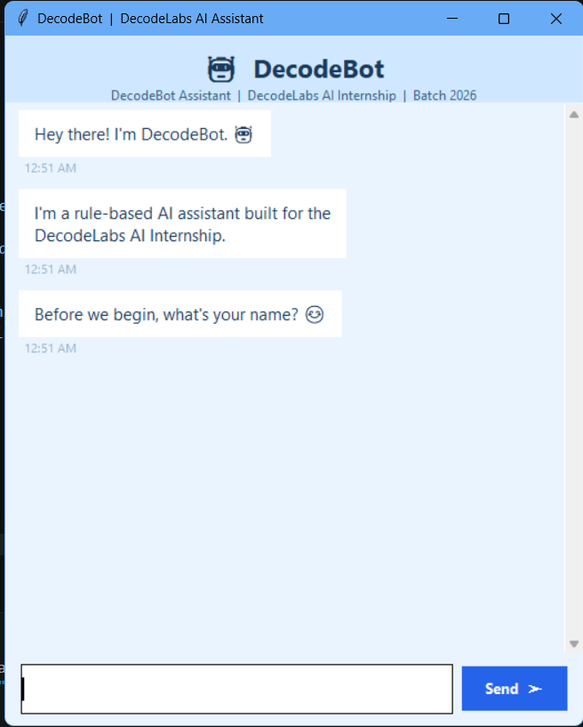
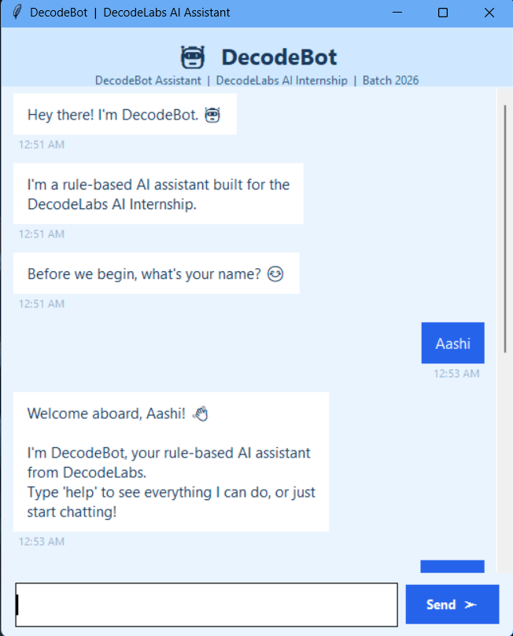
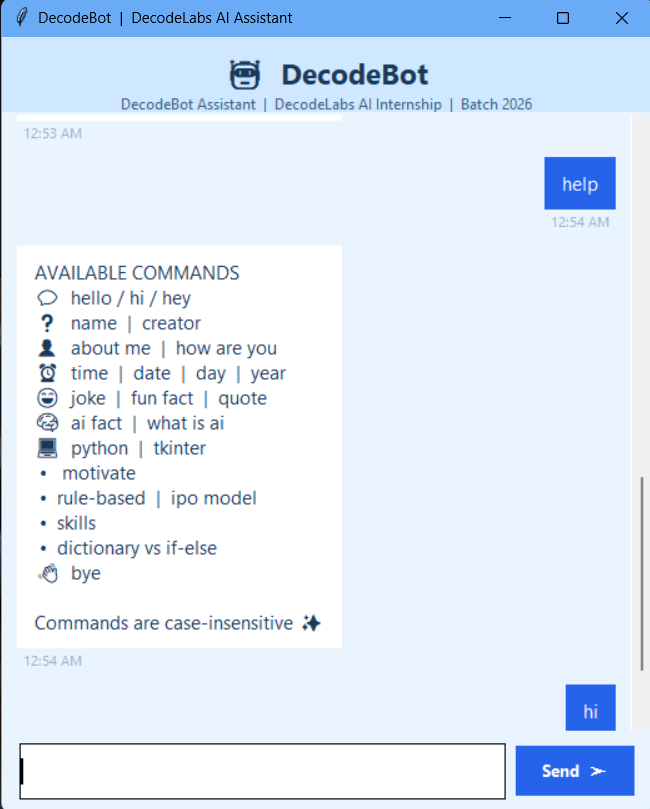
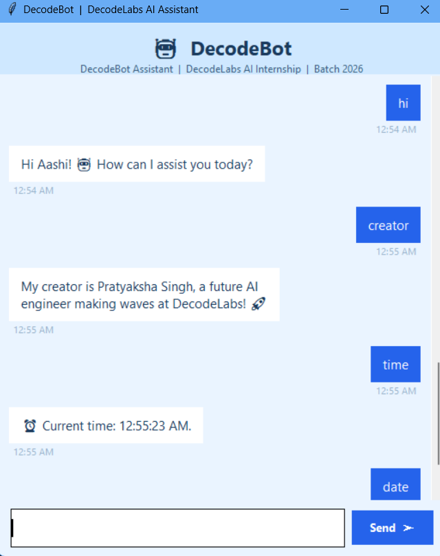
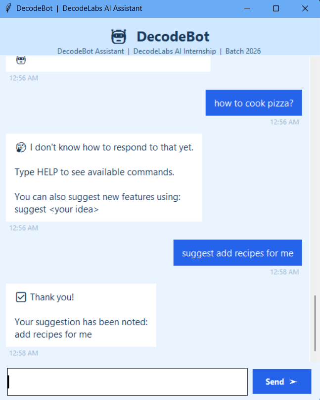
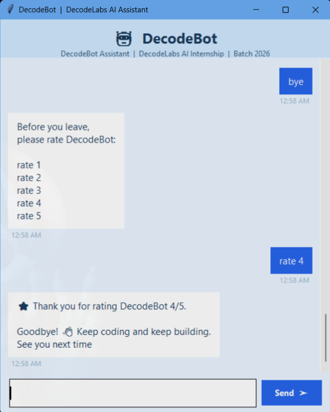

# DecodeBot Assistant

DecodeBot Assistant is a rule-based AI chatbot developed using Python and Tkinter as part of the DecodeLabs AI Internship.

The chatbot provides interactive conversations through predefined rules and commands while maintaining a simple and user-friendly graphical interface.


## Features

### User Personalization
- Stores user's name
- Allows changing name
- Personalized greetings and responses

### Date and Time Commands
- Current Time
- Current Date
- Current Day
- Current Year

### Interactive Commands
- Greetings
- Motivational Quotes
- Fun Facts
- Jokes
- Study Tips
- Small Talk Responses

### Feedback System
- User rating before exit
- Suggestion collection feature
- Unknown command handling

### GUI Features
- Chat bubble interface
- User messages aligned right
- Bot messages aligned left
- Scrollable chat window
- Fixed-size application window
- Sound notifications
- Keyboard Enter support


## Technologies Used

- Python 3
- Tkinter
- Winsound
- Datetime


## Project Structure

```text
Rule_based_ai_chatbot/
│
├── chatbot.py
├── README.md
├── requirements.txt
├── .gitignore
└── outputs/
```


## Available Commands

### Greetings
- hello
- hi
- hey
- good morning
- good afternoon
- good evening
- good night

### Information
- time
- date
- day
- year
- creator
- version
- skills

### Fun Commands
- joke
- quote
- motivate
- fun fact
- study

### Personalization
- my name is <name>
- who am i
- about me
- change my name to <name>

### Feedback
- suggest <your suggestion>
- rate 1
- rate 2
- rate 3
- rate 4
- rate 5

### Other
- thanks
- ok
- okay
- cool
- nice
- awesome
- help
- commands
- bye


## How It Works

DecodeBot follows a rule-based approach.

User input is matched against predefined conditions using Python conditional statements.

Example:

```python
elif msg == "time":
    return f"Current time: {datetime.now().strftime('%H:%M:%S')}"
```

The chatbot does not use machine learning models or external APIs.


## Running the Project

Clone the repository:

```bash
git clone https://github.com/pratyaksha0612/Rule_based_ai_chatbot.git
```

Navigate to the project folder:

```bash
cd Rule_based_ai_chatbot
```

Run the application:

```bash
python chatbot.py
```

## Screenshots

<p align="center">
  
  
</p>

<p align="center">
  
  
</p>

<p align="center">
  
  
</p>

## Future Improvements

- Store user suggestions in a file
- Export feedback reports
- Theme customization
- User profiles
- SQLite database integration
- Voice interaction

---

## Author

Pratyaksha Singh

Developed as part of the DecodeLabs AI Internship.